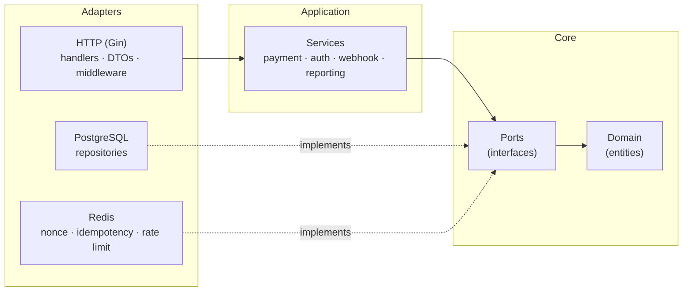

# Architecture

The gateway follows **Clean Architecture** (Ports & Adapters). Business rules live in the
centre and know nothing about HTTP, PostgreSQL or Redis; infrastructure plugs in from the
outside through interfaces.



## Dependency rules

| Layer | May import | Must not import |
| --- | --- | --- |
| `internal/core/domain` | standard library, `uuid` | anything else |
| `internal/core/ports` | `domain`, standard library, `uuid` | adapters, services, drivers (`pgx`, `go-redis`, `gin`) |
| `internal/service` | `core`, `pkg` | adapters |
| `internal/adapter/...` | `core`, `service`, `pkg`, drivers | — |

Database transactions are exposed to services through the abstract `ports.Tx` /
`ports.DBTransactor` interfaces, so services control transaction boundaries without
depending on `pgx`.

## Directory layout

```
cmd/api/main.go                 Entry point: config, dependency wiring, graceful shutdown
config/                         Viper config loader + validation (env prefix SPG_)
internal/
  core/
    domain/                     Entities: Merchant, Wallet, Transaction, IdempotencyLog,
                                WebhookDeliveryLog, AuditLog
    ports/                      Repository & service interfaces
      mocks/                    gomock mocks (generated with `make mocks`)
  service/                      Business logic
    payment_service.go            Payment / refund / top-up (locking + idempotency)
    auth_service.go               Registration (atomic merchant + wallet), login, JWT
    merchant_service.go           Profile, webhook URL, key rotation
    webhook_service.go            Async delivery with exponential backoff
    webhook_validator.go          SSRF-safe webhook URL validation
    reporting_service.go          Dashboard statistics, transaction history
    encryption_service.go         AES-256-GCM
    signature_service.go          HMAC-SHA256 (constant-time verify)
    hash_service.go               Argon2id password hashing
    token_service.go              JWT issue / verify
    audit_service.go              Async audit trail
  adapter/
    http/
      handler/                  Gin handlers, router, Swagger UI, embedded web UI
      dto/                      Request/response structs + custom validators
      middleware/               HMAC auth, JWT auth, rate limit, audit, CORS, timeout,
                                request ID, sanitizer, Prometheus metrics
    storage/
      postgres/                 pgx repositories (SELECT ... FOR UPDATE on wallets)
      redis/                    Nonce store, idempotency cache, rate-limit store
pkg/
  apperror/                     Typed errors mapped to codes in docs/api/ERROR_CODES.md
  logger/                       Zerolog setup
  response/                     Standard JSON envelope
web/                            Embedded merchant dashboard (HTML/CSS/JS, go:embed)
db/migrations/                  SQL migrations
monitoring/                     Prometheus config + provisioned Grafana dashboard
tests/
  integration/                  End-to-end + concurrency tests (in-memory repos, miniredis)
  load/                         k6 load test scenarios
scripts/demo/                   Python demo scripts (happy path, attacks, concurrency)
docs/                           Design notes, OpenAPI spec, error codes, webhook spec
```

## Invariants for contributors

1. **Wallet balance changes** happen inside a single DB transaction that first locks the
   wallet row with `SELECT ... FOR UPDATE`.
2. **Balances are never computed in SQL.** The encrypted balance is decrypted in memory,
   checked, updated, re-encrypted and written back — see
   [TRANSACTION_STRATEGY.md](TRANSACTION_STRATEGY.md).
3. **Idempotency** is checked before any money moves: Redis first, PostgreSQL
   `idempotency_logs` as the source of truth.
4. **No secrets or plaintext balances in logs.**
5. **Handlers never return domain entities** — map them to DTOs.
